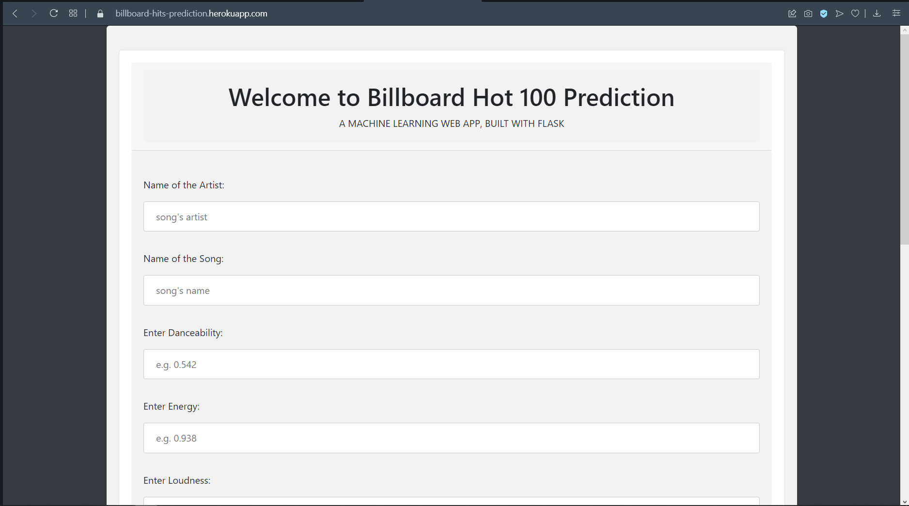

# Project Link:  [Billboard-Hot-100-Hits-Prediction](https://billboard-hits-prediction.herokuapp.com)

# Billboard Hot 100 Hit Prediction
:notes: Predicting Billboard's Year-End Hot 100 Songs using audio features from Spotify data.

## Overview
Each year, Billboard publishes its Year-End Hot 100 songs list, which denotes the top 100 songs of that year. The objective of this project was to see whether or not a machine learning classifier could predict whether a song would become a hit given its intrinsic audio features as well as lyrics.

The goal of this project is to see if a song's audio characteristics and lyrics can determine a song's popularity. Data and analytics aside, music listeners around the world probably have seen music trends change over time. Although each listener has custom interests in music, it is pretty clear when we listen to a hit song or soon to be hit song (consider Old Town Road). And over time, we see the characteristics of hit songs change. So, rather than using our intuition or "gut-feeling" to predict hit songs, the purpose of the project is to see if we can use intrinsic music data to identify hits.

Hit Song Science can help music producers and artists know their audience better and produce songs that their fans would love to hear. Artists can better know what lyrics to write and tune the meaning of their song to what their fanbase would enjoy. Additionally, audio engineers can work with musicians to tweak intrinsic music qualities to make a song more popular catchy and likable.

Also, it can highlight unknown artists whose music is characteristic of top songs on the Billboard Hot 100. This allows underground artists (i.e. Lil Tecca), who might not have the publicity help from an agency or a record label, to have a chance at gaining recognition. 

## Requirements

## Data and Features
A sample of songs was downloaded from [Kaggle](https://www.kaggle.com/danield2255/data-on-songs-from-billboard-19992019/download) and [The million songs](http://millionsongdataset.com/pages/getting-dataset/) which included songs from various albums. Made a new common column in both the datasets i.e. Top100 (Target Variable).
The songs which are on Billboard dataset, marked as 1 and those are on million songs dataset, marked as 0. Concatenated these two datasets into a bigger one which consists of 9227 songs.
The dataset consists of these features:
--> Artist                
--> Title                 
--> Top100                
--> URI                   
--> Danceability          
--> Energy                
--> Key                   
--> Loudness              
--> Mode                  
--> Speechiness           
--> Acousticness          
--> Instrumentalness      
--> Liveness              
--> Valence               
--> Tempo                 
--> Duration              
--> Time_Signature        
--> lyrics              
--> explicit              
--> Release_Year          
--> Genre                 

## Data Cleaning
Checked null values of dataset. The null values found only in 'lyrics' column as shown in the figure below.

Dropped lyrics column as it is not needed and contains null values and also looks like uri column contains song id we dont need it.

The dataset also contains same song with different artist. So I dropped duplicate rows also. Also checked unique values for each feature

After cleaning the data, a dataset of approx. 8653 songs was created.

## EXPLORATORY DATA ANALYSIS
## Data Visualization and Transformation

**Distribution of Genre

The distribution of release year is negatively skewed

**Removing outliers

The data points which are outside the inter-quartile range called outliers.

**Transforming Genre Column 

As you can see the 'genre' column contains categorical values, so I had to encode it as machine only understands the numerical values. And map it to a dictionary with value before encoding.

**Distribution of Column Top100

In the above graph, you can see that maximum songs fail to get into Top100 list. Only 16.4% songs appear in Top100 list.

**Distribution of Songs Release-Year Wise

From the graph, it is observed maximum songs are released between 2010-2020.

**Distribution of genre

Most of the songs released are of 'Pop', 'Rap' and 'Rock' genre. Half of the songs released are of Genre 'Pop'.

**Explaination of some audio features

**Spotify Features over Time for each decade**

CONCLUSIONS FROM THE PLOTS :

1.For a song to hit list of billboard 100 top songs, its danceability must be above than 0.6.

2.Songs with low loudness level, have more chances to hit billboard top 100 list.

3.Songs with acousticness level between 0.05 to 0.2 ,generally hits the billboard top 100 list.

**Correlation between each feature**

There is good positive correlation between Loudness and Energy. While Acoustiness and Energy are negatively correlated. Also there is negative correlation between Loudness and Acoustiness.

**Feature Comparisons**

Scatter plot shows that loud songs with High Energy makes up on the billboard Top100.

Rap songs preffered for dancing. While Metal types are least preffered.

**Feature distributions**

It is showing the distribution of each feature

**Audio Features vs Top100(Density)**

It seems that Valance, Tempo, key are not much significant features to predict if the song will be on Billboard or not. While Instrumentalness, Loudness and Energy seems to be significant.

**selected features on the basis on eda

1.  Danceability
2.  Energy
3.  Loudness
4.  Speechiness
5.  Acousticness
6.  Instrumentalness
7.  Liveness
8.  Valence
9.  Tempo
10. Genre

Saved the dataset with above features in a new dataset i.e. final_dataset.csv

## MODEL TRAINING

## Models
Given the unbalanced nature of the dataset, used SMOTE to balance it. Used Standardization technique to scale it down into one scale. So, in addition to aiming for high accuracy, another objective of modeling is to ensure a high AUC (so that TPR is maximized and FPR is minimized). The AUC tells us how well the model is capable of distinguishing between the two classes.

Here's a list of all the models I tested:
  1. Decision Tree 
  2. Improved Decision Tree (with hyperparameter tuning)
  4. Improved LDA (with hyperparameter tuning)
  5. Decision Tree with Adaboost (with hyperparameter tuning)
  
**Model Summaries:**

| Model   | Accuracy   | AUC   |
| -----   | :--------: | :---: |
| Decision Tree | 0.74 | 0.77 |
| Improved Decision Tree | 0.75 | 0.79 |
| Improved LDA | 0.65 | 0.70 |
| Decision Tree with Adaboost | 0.83 | 0.90 |

**Model Summary:**

| Accuracy   | AUC   |
| :--------: | :---: |
| 0.83 | 0.90 |

The Decision tree-Adaboost with hyper parameter tuning model gave the highest accuracy score and AUC score.

#### Deployment:
With the help of [Flask](https://flask.palletsprojects.com/en/2.0.x/) framework, I have created a web app (link given on the top) which takes audio features as input and predict whether the song wiil hit Billboard or not? Also used HTML and CSS to design the web app. Below are some screenshots:

you have to press the Predict button after everything is done.

And the Prediction page will look like this.

I have used [Heroku](https://www.heroku.com/about) to deploy this web app in the web. You can also check the offical website of [Heroku](https://www.google.com/url?sa=t&rct=j&q=&esrc=s&source=web&cd=&cad=rja&uact=8&ved=2ahUKEwioqOCf7rfyAhXPqksFHQ2uAkoQFnoECBUQAw&url=https%3A%2F%2Fwww.heroku.com%2F&usg=AOvVaw1V4lhSv6mb_lZj6UUCUXpS).
Using Github, you can deploy any web app to [Heroku](https://youtu.be/mrExsjcvF4o) in a very easy way.

## Conclusion
The best model after testing seems to Decision Tree and Adaboost. Both these models yielded high accuracy (~83%) and AUC (~0.90). Also, the stacked model did a good job of minimizing FPR and helped increase the AUC.

## Future Work
The audio features it has, a common person will not able to find out. So to solve this I will add spotify API to it. In this, you have to select the name of the Singer, name of the album and name of the song and it will pass through the Spotify API and it will extract the audio features from the song.

## Sources
1. https://www.kaggle.com/danield2255/data-on-songs-from-billboard-19992019
2. http://millionsongdataset.com/pages/getting-dataset/
3. https://www.google.com/url?sa=t&rct=j&q=&esrc=s&source=web&cd=&cad=rja&uact=8&ved=2ahUKEwioqOCf7rfyAhXPqksFHQ2uAkoQFnoECBUQAw&url=https%3A%2F%2Fwww.heroku.com%2F&usg=AOvVaw1V4lhSv6mb_lZj6UUCUXpS
